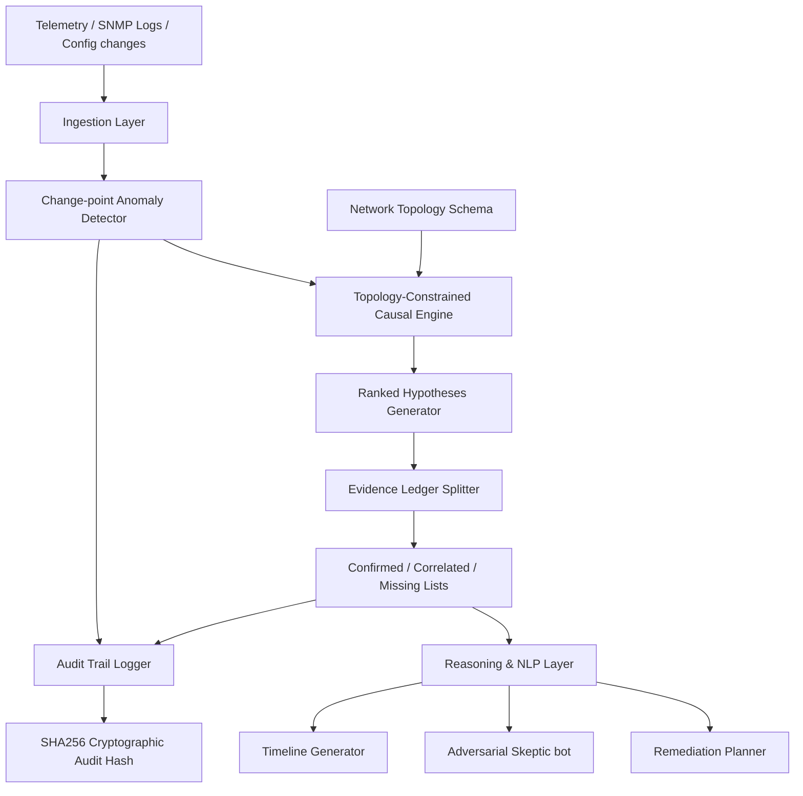

# Network Anomaly Root-Cause Assistant: Architecture

The Network Anomaly Root-Cause Assistant architecture is divided into a deterministic core and a bounded reasoning layer to ensure causal correctness constrained by network topology.

## Core System Architecture

## Layers Overview

### 1. Ingestion & Anomaly Detection
- Telemetry, logs, alerts, and configuration commits are continuously parsed.
- Robust baseline and change-point algorithms identify the exact microsecond timestamp of anomalies rather than simple threshold violations.

### 2. Topology-Constrained Causal Engine
- Imposes structural constraints using the physical and logical network dependency map.
- A component is only evaluated as a candidate root cause if a valid, directed dependency path connects it to the downstream symptom component (preventing time-based correlation false positives).

### 3. Evidence Ledger
- Generates a three-tier ledger for every proposed hypothesis:
  - **Confirmed**: Direct evidence linking config/hardware updates directly to the node state.
  - **Correlated**: Downstream alert and telemetry metrics matching propagation timelines.
  - **Missing**: Expected signals that did not fire, pointing to diagnostic gaps or ruling out alternate hypotheses.

### 4. Bounded NLP & Skeptic Agent
- Formulates English narratives of the incident.
- Runs an adversarial dialogue (Skeptic vs. Investigator) to highlight debugging assumptions and prompt secondary verification steps.
- Suggests structured remediation scripts based on the active evidence ledger.
